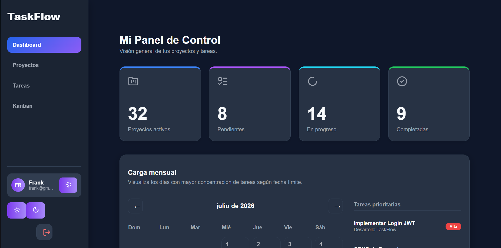

# 🚀 TaskFlow

Sistema web para la gestión de proyectos y tareas desarrollado con **React**, **Node.js**, **Express** y **Microsoft SQL Server**.

> Proyecto desarrollado como Trabajo Final del curso **Pruebas y Aseguramiento de Calidad de Software**.

---

# 📌 Descripción

TaskFlow es una plataforma web diseñada para facilitar la administración de proyectos y tareas mediante una interfaz moderna e intuitiva.

La aplicación permite a cada usuario gestionar sus propios proyectos, organizar tareas mediante un tablero Kanban, visualizar estadísticas desde un Dashboard interactivo y controlar la carga de trabajo semanal, todo ello utilizando autenticación segura basada en JWT.

El proyecto sigue una arquitectura cliente-servidor, separando completamente el frontend, backend y la base de datos para facilitar el mantenimiento y escalabilidad.

---

# ✨ Funcionalidades

- 🔐 Autenticación mediante JWT y bcrypt
- 👤 Registro e inicio de sesión de usuarios
- 📁 Gestión completa de proyectos (CRUD)
- ✅ Gestión completa de tareas (CRUD)
- 📋 Tablero Kanban para administración de estados
- 📊 Dashboard con estadísticas generales
- 📅 Calendario de carga semanal según fechas límite
- ⭐ Visualización de tareas prioritarias
- 📈 Registro de actividad reciente
- 🌙 Tema oscuro / claro
- 🔎 Búsqueda y filtros dinámicos
- 📱 Interfaz moderna y responsive

---

# 🏗 Arquitectura

```
                    Frontend
               React + Vite + Axios
                       │
                       ▼
              API REST (Express.js)
                       │
          JWT Authentication Middleware
                       │
                       ▼
           Microsoft SQL Server
```

---

# 🛠 Tecnologías utilizadas

## Frontend

- React
- Vite
- Axios
- Recharts
- Lucide React
- CSS3

## Backend

- Node.js
- Express.js
- JWT
- bcrypt
- mssql
- dotenv

## Base de datos

- Microsoft SQL Server

---

# 📂 Estructura del proyecto

```
TaskFlow
│
├── backend
│   ├── src
│   │   ├── config
│   │   ├── controllers
│   │   ├── middleware
│   │   ├── repositories
│   │   ├── routes
│   │   ├── services
│   │   └── server.js
│
├── frontend
│   ├── src
│   │   ├── components
│   │   ├── pages
│   │   ├── services
│   │   ├── styles
│   │   └── App.jsx
│
├── database
├── diagrams
├── doc
├── evidence
└── README.md
```

---

# 🗄 Base de datos

El sistema utiliza tres entidades principales.

```
Usuarios
│
├── Proyectos
│      │
│      └── Tareas
│
└── Tareas
```

### Tablas

- usuarios
- proyectos
- tareas

---

# ⚙ Instalación

## 1. Clonar el repositorio

```bash
git clone https://github.com/TU-USUARIO/TU-REPOSITORIO.git
```

---

## 2. Backend

```bash
cd backend
npm install
npm run dev
```

---

## 3. Frontend

```bash
cd frontend
npm install
npm run dev
```

---

## 4. Base de datos

Ejecutar los scripts en el siguiente orden:

```
database/schema.sql
```

Posteriormente:

```
database/taskflow_seed.sql
```

---

# 🔑 Variables de entorno

Crear un archivo `.env` dentro del backend.

```env
PORT=4000

JWT_SECRET=your_secret_key

DB_SERVER=localhost
DB_DATABASE=TaskFlow
DB_USER=usuario
DB_PASSWORD=contraseña
DB_PORT=1433
```

---

# 🌐 Endpoints principales

## Autenticación

```
POST /api/auth/login

POST /api/auth/register
```

## Proyectos

```
GET    /api/projects
POST   /api/projects
PUT    /api/projects/:id
DELETE /api/projects/:id
```

## Tareas

```
GET    /api/tasks
POST   /api/tasks
PUT    /api/tasks/:id
DELETE /api/tasks/:id
```

---

# 📷 Capturas del sistema

Las evidencias del proyecto se encuentran en la carpeta:

```
evidence/
```

Se recomienda incluir capturas de:

- Login
- Dashboard
- Gestión de proyectos
- Gestión de tareas
- Kanban
- Calendario de carga

---

# 📈 Estado del proyecto

| Módulo | Estado |
|---------|--------|
| Autenticación | ✅ |
| Dashboard | ✅ |
| Gestión de proyectos | ✅ |
| Gestión de tareas | ✅ |
| Kanban | ✅ |
| Calendario de carga | ✅ |
| Tema oscuro | ✅ |
| Responsive | ✅ |
| Configuración de usuario | 🚧 |
| Despliegue | 🚧 |

---

# 👨‍💻 Autor

**Franck Cárdenas Bellido**

Universidad Nacional de San Cristóbal de Huamanga

Escuela Profesional de Ingeniería de Sistemas

Curso: **Pruebas y Aseguramiento de Calidad de Software**

Año: **2026**

---

# 📄 Licencia

Proyecto desarrollado con fines académicos para el curso **Pruebas y Aseguramiento de Calidad de Software**.


---

# Spec-Driven Development (OpenSpec)

TaskFlow utiliza un enfoque **Spec-Driven Development (SDD)** para organizar la documentación y trazabilidad del desarrollo.

La estructura implementada basada en OpenSpec permite relacionar:


Especificaciones
|
v
Diseño
|
v
Implementación
|
v
Pruebas


La documentación del proceso se encuentra organizada mediante:

- `.openspec.yaml` → configuración del proyecto.
- `proposal.md` → definición y alcance.
- `design.md` → arquitectura y decisiones técnicas.
- `tasks.md` → planificación de implementación.
- `specs/` → especificaciones por módulo.

Módulos documentados:

- Autenticación de usuarios.
- Gestión de proyectos.
- Gestión de tareas.
- Dashboard.
- Pruebas de software.

---